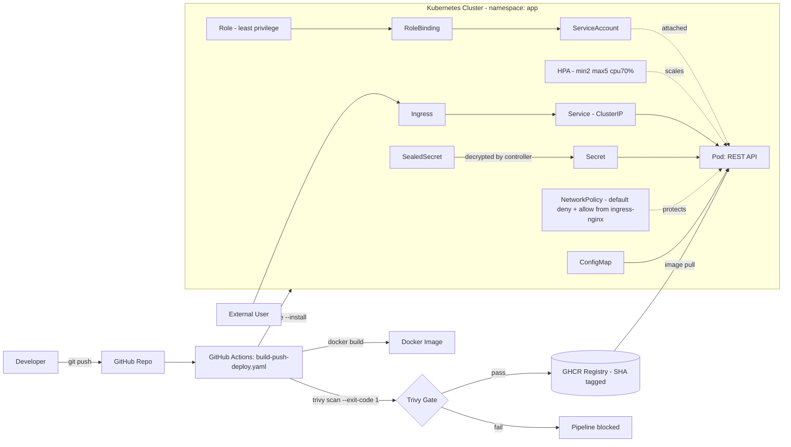

# devops-k8s-pipeline

A production-grade Kubernetes deployment pipeline for a Node.js REST API — multi-stage Docker builds, Sealed Secrets, RBAC, NetworkPolicy, HPA, Helm, and a GitHub Actions CI/CD pipeline with vulnerability scanning, all deployed and verified together on a live cluster.

## Architecture

> Rendered as Mermaid rather than a static PNG — GitHub renders it natively, and it stays in sync with the repo instead of going stale as a binary asset.



## Repository Structure

```
devops-k8s-pipeline/
├── src/                          # Node.js REST API source
├── Dockerfile                    # Multi-stage, non-root build
├── k8s/                          # Raw Kubernetes manifests
│   ├── namespace.yaml
│   ├── deployment.yaml
│   ├── service.yaml
│   ├── configmap.yaml
│   ├── hpa.yaml
│   ├── ingress.yaml
│   ├── networkpolicy.yaml
│   ├── serviceaccount.yaml
│   ├── role.yaml
│   ├── rolebinding.yaml
│   └── sealedsecret.yaml
├── helm/
│   └── app-chart/
│       ├── Chart.yaml
│       ├── values.yaml
│       ├── values-dev.yaml
│       ├── values-prod.yaml
│       └── templates/
├── .github/
│   ├── workflows/
│   │   └── build-push-deploy.yaml
│   └── dependabot.yml
└── docs/
    └── screenshots/
```

## Kubernetes Manifests

| File | Purpose | Key detail |
|---|---|---|
| `namespace.yaml` | Isolates all app resources in the `app` namespace | Also templated in the Helm chart — see [Helm Chart](#helm-chart) for the namespace-adoption pattern this requires |
| `deployment.yaml` | Runs the REST API pods | Rolling update strategy: `maxSurge: 1`, `maxUnavailable: 0` — zero downtime during rollouts; requests/limits set so the scheduler and HPA can both function |
| `service.yaml` | Stable internal DNS + load balancing to pods | `ClusterIP` — internal only, exposed externally via Ingress |
| `configmap.yaml` | Non-secret app configuration | Consumed via `envFrom` |
| `hpa.yaml` | Autoscaling | Min 2 / max 5 replicas, target 70% CPU utilization |
| `ingress.yaml` | External HTTP routing into the cluster | Routes to the `service.yaml` ClusterIP |
| `networkpolicy.yaml` | Restricts which traffic can reach the pod | Default-deny ingress, explicit allow only from the `ingress-nginx` namespace via `namespaceSelector` |
| `serviceaccount.yaml` | Dedicated pod identity | Named, not `default` — `automountServiceAccountToken: false` since the app never calls the Kubernetes API |
| `role.yaml` / `rolebinding.yaml` | Least-privilege RBAC | Scoped to the `app` namespace only |
| `sealedsecret.yaml` | Encrypted credential delivery | Safe to commit — decrypted only by the in-cluster Sealed Secrets controller |

## Security Design

- No static credentials anywhere in CI — GHCR push uses `GITHUB_TOKEN`, a token GitHub generates and scopes automatically per workflow run, not a long-lived PAT.
- Containers run as a non-root user.
- Secrets are never committed in plaintext — only Sealed Secrets ciphertext.
- Default-deny NetworkPolicy — every pod is isolated unless explicitly allowed.
- Dedicated ServiceAccount per app, least-privilege Role, no reliance on the `default` ServiceAccount.
- Every image is scanned for HIGH/CRITICAL CVEs before it can be deployed — the pipeline fails closed, not open.

## Sealed Secrets Workflow

Why: a Kubernetes `Secret` is base64-encoded, not encrypted — anyone with `kubectl get secret -o yaml` or repo access can decode it in one command. Sealed Secrets solves this by encrypting the Secret client-side, so only the in-cluster controller (holding the private key) can decrypt it.

```bash
# 1. Create the plain secret ONLY in /tmp — never in the repo
kubectl create secret generic app-secret \
  --from-literal=DB_PASSWORD='<value>' \
  --dry-run=client -o yaml > /tmp/secret.yaml

# 2. Seal it using the controller's public key
kubeseal --format=yaml < /tmp/secret.yaml > k8s/sealedsecret.yaml

# 3. Delete the plaintext file immediately
rm /tmp/secret.yaml

# 4. Commit only the sealed (encrypted) version
git add k8s/sealedsecret.yaml
git commit -m "feat: add Sealed Secrets"
git push

# 5. Verify the plaintext secret never touched git history
git log --all --full-history -- k8s/secret.yaml
# → returns nothing
```

The `SealedSecret` object is safe in a public repo: without the controller's private key (which never leaves the cluster), the ciphertext is useless. On apply, the controller decrypts it into a normal Kubernetes `Secret` inside the cluster only.

## RBAC

- `serviceaccount.yaml` — a named ServiceAccount, not the namespace's `default` one.
- `role.yaml` — the absolute minimum verbs the app needs. This app doesn't call the Kubernetes API at all (config arrives via `envFrom`/mounted volumes), so the Role is intentionally close to empty — a deliberate design decision, not an oversight.
- `rolebinding.yaml` — scoped to the `app` namespace, capping the Role's reach even if it were broader.
- `automountServiceAccountToken: false` on the pod spec — since the app has no legitimate reason to talk to the API server, it doesn't get a credential capable of doing so, which closes off a lateral-movement path if the container is ever compromised.

## HPA & metrics-server

HPA needs real CPU metrics to scale, and those metrics come from `metrics-server`, not from Kubernetes itself. On minikube, `metrics-server` doesn't work out of the box because it can't verify the kubelet's self-signed TLS certificate — this shows up as `kubectl describe hpa` reporting `<unknown>` instead of a percentage.

```bash
minikube addons enable metrics-server

kubectl patch deployment metrics-server -n kube-system --type='json' \
  -p='[{"op":"add","path":"/spec/template/spec/containers/0/args/-","value":"--kubelet-insecure-tls"}]'

kubectl rollout status deployment/metrics-server -n kube-system
```

One real gotcha hit while building this: re-running the patch command more than once (while debugging an unrelated issue) appended `--kubelet-insecure-tls` to the args array four times over, since a JSON-patch `add` operation always appends rather than checking for an existing value. Cleaned up with a single `op: replace` supplying the full, deduplicated args array in one shot — `add` and `replace` are not interchangeable for idempotent patching.

Verified end state:

```bash
kubectl describe hpa -n app
# → cpu: 2%/70% (real number, not <unknown>)

curl localhost:3000/health
# → {"status":"ok"}
```

## Helm Chart

```
helm/app-chart/
├── Chart.yaml
├── values.yaml           # defaults
├── values-dev.yaml       # dev overrides only
├── values-prod.yaml      # prod overrides only
└── templates/
    ├── namespace.yaml
    ├── deployment.yaml
    ├── service.yaml
    ├── configmap.yaml
    ├── hpa.yaml
    ├── ingress.yaml
    ├── networkpolicy.yaml
    ├── serviceaccount.yaml
    ├── role.yaml
    ├── rolebinding.yaml
    └── _helpers.tpl
```

`helm lint` clean, `helm template` produces valid YAML for every manifest.

**Namespace adoption pattern (real issue, not theoretical):** this chart templates its own `Namespace` resource. On a fresh cluster, `helm install` can fail with `Error: INSTALLATION FAILED: create: failed to create: namespaces "app" not found` — even though the chart is completely valid. This isn't a chart bug; it's a race between Helm creating the Namespace and the API server finishing registration before Helm's very next resource-creation call in the same release. `--create-namespace` is not a safe workaround here — it creates an untracked namespace that then collides with the chart's own templated one.

Fix:

```bash
kubectl create namespace app

kubectl label namespace app app.kubernetes.io/managed-by=Helm
kubectl annotate namespace app \
  meta.helm.sh/release-name=app \
  meta.helm.sh/release-namespace=app

helm install app ./helm/app-chart -f helm/app-chart/values-dev.yaml
```

Stamping the namespace with Helm's exact ownership metadata makes Helm adopt the existing namespace instead of trying (and failing) to create it fresh.

*Backlog: convert this into a Helm `pre-install` hook so future clean-cluster installs don't need the manual pre-create step. Not implemented yet — the manual fix is well understood and this is new material beyond the original Helm curriculum.*

## CI/CD Pipeline

`.github/workflows/build-push-deploy.yaml` — two jobs, two different triggers:

**`build`** — runs automatically on every push to `main`:
1. Checkout code
2. Log in to GHCR using `GITHUB_TOKEN` — a token GitHub auto-generates per workflow run, scoped by the `permissions:` block (`packages: write` here), and never stored as a long-lived secret. No PAT, no static credential.
3. Build the Docker image
4. **Trivy scan** — pipeline fails closed if HIGH/CRITICAL CVEs are found (see below)
5. Push the image to GHCR tagged with `${{ github.sha }}` — never `latest`

**`deploy`** — runs only on manual `workflow_dispatch`, never automatically on push:
6. Configure kubeconfig from a `KUBE_CONFIG_DATA` secret
7. Pre-create and Helm-adopt the target namespace (see the [Helm Chart](#helm-chart) namespace-adoption pattern)
8. `helm upgrade --install ... --set image.tag=${{ github.sha }}`

**Why deploy is gated, not automatic:** GitHub-hosted runners have no reachable Kubernetes cluster by default. A `deploy` job wired into the same trigger as `build` would fail on every single push — not intermittently, structurally, since there's nothing for `helm upgrade` to connect to. Rather than leave a job in the pipeline that can never succeed as designed, `deploy` only runs on an explicit `workflow_dispatch`, against a cluster whose kubeconfig is supplied as a secret. This also mirrors how most real deploy pipelines work: build/test/scan on every commit, deploy behind an explicit gate — not blind auto-deploy on every merge.

**Why SHA tags, not `latest`:** every image is traceable to the exact commit that produced it, and a rollback is just redeploying a known-good SHA — no ambiguity about what `latest` currently points to. The tradeoff: `values.yaml`'s dev default of `image.tag: latest` is intentional for local development, but since the pipeline only ever publishes SHA tags, a bare `helm install` without an explicit `--set image.tag=<sha>` override will fail with `manifest unknown`. That's expected behavior, not a bug — see [Local Deployment](#local-deployment-minikube).

## Vulnerability Scanning (Trivy)

```yaml
- name: Scan image for vulnerabilities
  run: |
    docker run --rm aquasec/trivy image \
      --exit-code 1 \
      --severity HIGH,CRITICAL \
      ${{ env.REGISTRY }}/${{ env.IMAGE_NAME }}:${{ github.sha }}
```

`--exit-code 1` means the pipeline fails the build if any HIGH or CRITICAL CVE is found — vulnerabilities block the release rather than being logged and ignored.

Real findings from the first scan: **13 HIGH vulnerabilities.**
- **2** in Alpine OS packages (`libcrypto3`, `libssl3`) — fixed with `apk update && apk upgrade --no-cache` in the runtime stage.
- **11** traced to the npm CLI's own bundled dependency tree — not anything in this project's `package.json`. Since the container's `CMD` calls `node` directly and never invokes `npm`/`npx` at runtime, those binaries (and their vulnerable dependencies) were removed from the runtime image entirely rather than chasing unfixable upstream overrides.

Re-scan after the fix: **0 HIGH/CRITICAL.**

## Dependency Updates (Dependabot)

`.github/dependabot.yml` watches two ecosystems on a weekly schedule: `npm` (application dependencies) and `github-actions` (workflow action versions) — kept as separate entries since they're different ecosystems with different update cadences and risk profiles.

## Local Deployment (Minikube)

```bash
minikube start
minikube addons enable ingress
minikube addons enable metrics-server

kubectl patch deployment metrics-server -n kube-system --type='json' \
  -p='[{"op":"add","path":"/spec/template/spec/containers/0/args/-","value":"--kubelet-insecure-tls"}]'
kubectl rollout status deployment/metrics-server -n kube-system

# Pre-create + adopt the namespace (see Helm Chart section above)
kubectl create namespace app
kubectl label namespace app app.kubernetes.io/managed-by=Helm
kubectl annotate namespace app \
  meta.helm.sh/release-name=app \
  meta.helm.sh/release-namespace=app

# Deploy with the actual published SHA tag — "latest" was never published
helm install app ./helm/app-chart \
  -f helm/app-chart/values-dev.yaml \
  --set image.tag=<actual-sha-from-ghcr>
```

Verify:

```bash
kubectl get pods -n app
# → Running 1/1

kubectl describe hpa -n app
# → cpu: 2%/70%

curl localhost:3000/health
# → {"status":"ok"}
```

Screenshots of the verified deployment: [`docs/screenshots/`](./docs/screenshots/)

## What I Learned

- **Layer cache order matters more than it looks.** Copying `package*.json` before the rest of the source (before `npm ci`) means Docker only reinstalls dependencies when they actually change — not on every single source edit.
- **NetworkPolicy is additive, not exclusive.** The moment any policy selects a pod, all unlisted traffic is denied by default — multiple policies stack their allow-rules rather than overriding each other, which is easy to get backwards under pressure.
- **A syntactically valid Helm chart can still fail on a fresh cluster.** The namespace-registration race between Helm's Namespace creation and its next resource call isn't a chart bug — it's an API-server timing issue, and the fix (pre-create + ownership-annotation adoption) is a pattern worth reusing on any chart that templates its own Namespace.
- **SHA tags vs `latest` is a deliberate tradeoff, not a default to "fix."** The instinct when `manifest unknown` shows up is to make `latest` exist. The correct fix was the opposite: keep the SHA-only publishing design for traceability, and make the deploy command specify the tag explicitly.
- **Vulnerability scanning the built image catches things `npm audit` never will.** 11 of 13 HIGH findings were in the npm CLI's own bundled dependencies — completely invisible to `npm audit`, which only looks at `package.json`'s tree — and they were unused at runtime entirely, so the real fix was removing the binary, not patching it.
- **`kubectl patch` with `op: add` is not idempotent.** Re-running the same JSON-patch add operation multiple times appends duplicate array entries instead of no-op'ing — `op: replace` with the full desired array is the safe way to apply the same patch more than once.
- **A CI job that can never succeed in its runner environment is worse than no job at all.** The `deploy` job was originally wired to run on every push despite GitHub-hosted runners having no reachable cluster — guaranteed to fail every single time, for reasons that had nothing to do with the code being deployed. Gating it behind `workflow_dispatch` turned a permanently-red job into an accurate signal: automatic CI now reports what's actually true (build, scan, and push all succeed), and deploy is a deliberate, on-demand action instead of a job destined to fail by design.

## Tech Stack

Node.js · Express · Docker · Kubernetes · Helm · Sealed Secrets · RBAC · NetworkPolicy · HPA · GitHub Actions · Trivy · Dependabot · minikube

## License

MIT
